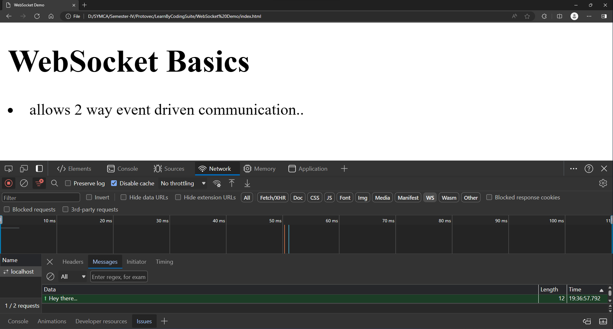

# LearnByCodingSuite <!-- omit in toc -->

A compilation of small react apps built to understand various concepts I come across with.

## Table of Contents <!-- omit in toc -->
- [Axios Post Demo](#axios-post-demo)
  - [Why axios is used?](#why-axios-is-used)
- [chart-js-demo](#chart-js-demo)
- [Horizontal scrollable line chart](#horizontal-scrollable-line-chart)
- [Realtime CPU Usage Demo](#realtime-cpu-usage-demo)
- [Realtime Graph Socket Demo](#realtime-graph-socket-demo)
- [WebSocket Demo](#websocket-demo)
  - [Why use WebSockets?](#why-use-websockets)
  
## Axios Post Demo

### Why axios is used?
- send asynchronous HTTP requests to REST endpoints
- perform CRUD operations
- communicate with the backend

## chart-js-demo

A static app to learn setup a simple line chart with the help of ChartJS library. 

## Horizontal scrollable line chart

A linechart which limits the number of labels displayed on the x axis at a time and uses the scrolling effect to navigate to the rest of the data.

## Realtime CPU Usage Demo

Tracks the CPU usage in realtime using the OS Utils and the ChartJS libraries.

## Realtime Graph Socket Demo

Plots the data generated by Math.random()

## WebSocket Demo

Server Console

Data sent from the client

Client Console

### Why use WebSockets?
- When the data exchange is 2-way (not just from server to client)
- Connection is initiated only when data is required and ended immediately after the data is fetched. 
- Keeps the number of active connections to database at minimum.